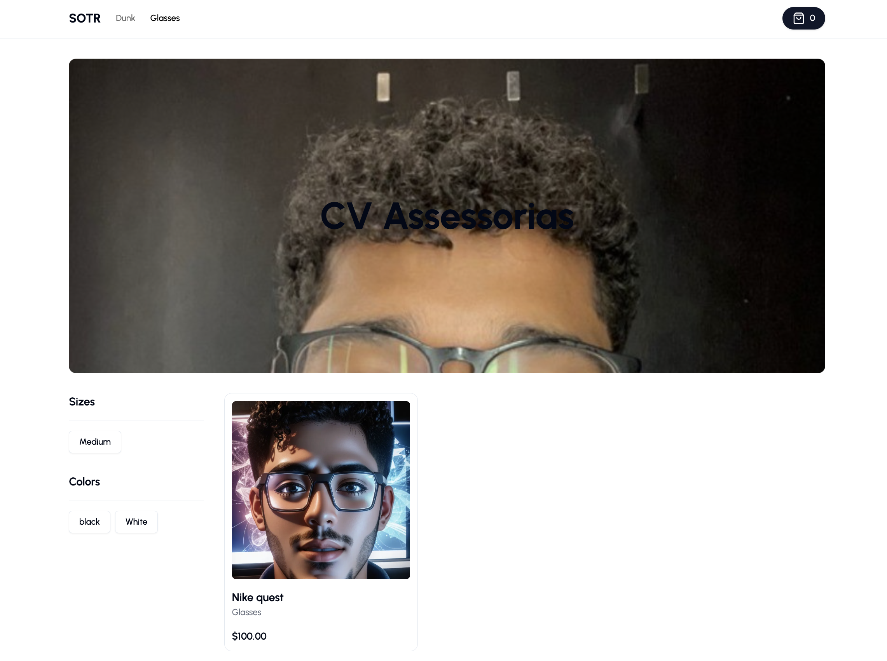

# ShopPilot - Store -- [Live Demo](https://shoppilot-store.vercel.app)
ShopPilot Store is an E-commerce designed to test the management and show data from my [CMS (Content Manager System) application](https://shoppilot-admin.vercel.app).
<br /><br />



## # Purpose
The purpose of this project is only to test if all modifications (creations, updates, etc) that I made in my CMS application work. It is a simple landing page showing the data created on [ShopPilot Admin](https://shoppilot-admin.vercel.app)

### # Technologies used
- Next.js
- TailwindCss
- Zustand
- Axios
- shadcn-ui

### Run the project
This project was created using [Next.js](https://nextjs.org/)
<br />

First, install the deps and run the development server:
<br />
```bash
npm install 
# or
yarn install
# or
pnpm i
```
Then, run the project:
```bash
npm run dev
# or
yarn dev
# or
pnpm dev
```

Open [http://localhost:3000](http://localhost:3000) with your browser to see the result.
